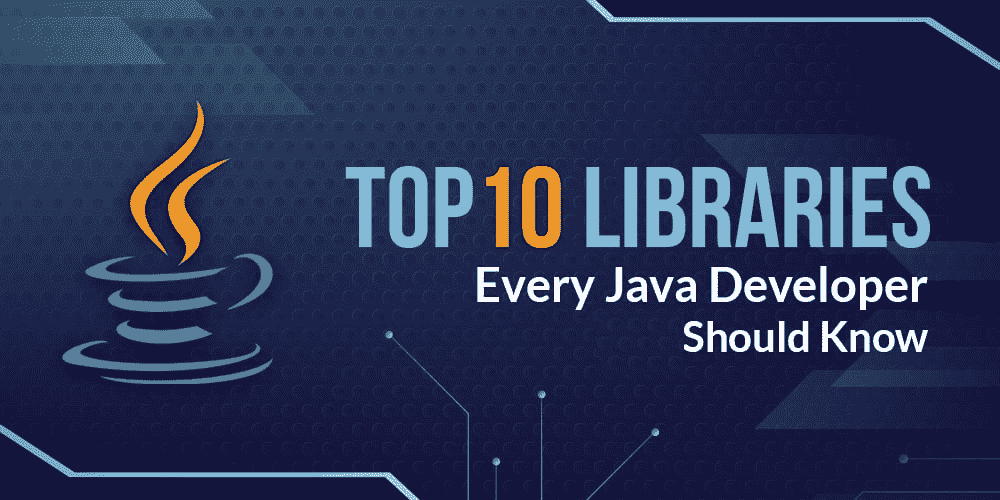

# 每个 Java 开发人员都应该知道的十大库

> 原文:[https://www . geesforgeks . org/top-10-libraries-ever-Java-开发者应该知道/](https://www.geeksforgeeks.org/top-10-libraries-every-java-developer-should-know/)

现在，企业、公司、学生、开发人员比以往任何时候都更加意识到信息技术及其分支的无处不在，包括**编程**和**软件开发**。软件工程师和信息技术专业人员是收入最高的专业人员。也就是说，这也是一个不断发展的职业，为了跟上这些更新，你必须不断学习。在类似的背景下， **Java 开发人员**是当今最令人垂涎的职业选择之一。这一成功可以归功于语言本身的多功能性。 **[Java](https://www.geeksforgeeks.org/java/)** 是一种强大的通用语言，用于 web 应用程序、移动应用程序和计算机游戏。

Java 的一些优点包括:

*   快速处理，
*   写一次，在任何地方运行，跨平台
*   面向对象语言，可重用代码
*   易于学习、编写、编译和调试

上述特性使 Java 成为最常用的编程语言之一，GitHub 估计全球有 900 多万用户。 **Java 开发人员**需要与同行的软件和网络开发人员合作，为 Java 应用程序开发应用程序代码，设计、实现、执行和测试现有的 Java 应用程序&代码，同时集思广益，为软件和应用程序提供更好的设计思路。

每个开发人员或多或少都知道使用库的好处——消除冗余，从而节省时间。对于每种编程语言，都有学习和掌握它的基础框架和库。对于寻找 **Java 库**来学习和成长的 Java 开发人员，我们列出了每个 Java 开发人员都应该知道的**十大库**。

### 1.Java 标准库

从编程语言本身提供的框架和库开始，总是最好的。开发工具也是如此。Java 提供的 Java 标准库经常被忽略，但是拥有一些最健壮和功能最强的库。举几个例子:

*   Java.util
*   Java.lang
*   Java.math
*   Java.net
*   Java.io /Java .不合格

**Java 标准库**帮助学生和新的 Java 开发者建立强大的基础，进一步帮助他们固化概念，高效学习不同的第三方库。

### 2.单元测试库

从名字上多少可以推断出，Mockito 是一个开源的嘲讽框架。Java 开发人员通常被期望能够熟练地进行单元测试。Mockito 帮助开发人员使用干净简单的 API 编写测试。它使开发人员能够测试双对象或虚拟对象的行为驱动和测试驱动行为。根据 StackOverflow 的说法，Mockito 被选为 Java 的最佳嘲讽框架。

### 3.单元测试库

另一个**单元测试框架**，JUnit 让 Java 程序员创建测试用例，运行单元测试。单元测试工具对于修复 bug 至关重要，这就是为什么掌握单元测试工具变得势在必行。每次开发人员运行测试时，JUnit 都会创建测试类的新样本。需要注意的一件重要事情是，创建相互独立的测试用例对于 JUnit 来说很重要，因为 JUnit 随机运行测试，而不遵循设定的顺序。

### 4.阿帕奇公共图书馆

Apache Commons 的官方网站称 Apache Commons 是一个 Apache 项目，旨在实现**可重用 Java 组件**的所有方面，即 Java 库。它是各种库的通用库。举几个例子-

*   公共输入输出
*   公共数字
*   共享文本
*   CSV 公用程式
*   BSF 公共区
*   共享密码

上面提到的 Apache Commons 库列表并不是详尽的。Java 开发人员可以利用 Apache Commons 上的大量可用库资源，而不必参考其他来源。

### 5.谷歌番石榴[通用库]

作为 Apache Commons 的替代，Google Guava 是一个包含核心 Java 库的开源程序。Guava 为 Java 提供了额外的高级特性和功能，其中一些包括新的泛型类，如多集和位图、字符串、输入/输出、缓存、图形库等。番石榴一直是最受欢迎的 Java 库之一。

通常分为三类，即-

*   实现通用方法和行为的基本实用程序
*   谷歌收藏库
*   提供生产力功能的其他实用程序

### 6.杰克逊[JSON 解析库]

杰克逊可能是最常用的 JSON 解析库，以其高性能、轻量级和准确性而闻名。它允许开发人员将 Java 对象序列化并映射到 JSON，反之亦然。Jackson 有各种工具，并使用各种方法来处理 JSON，例如在 POJO 类上使用数据绑定注释、附加数据格式模块等。它还支持不同的数据类型，如标准集合数据类型、Java 8 模块、休眠等。，并且可以处理在 BSV、XML、CBOR、BSON、TOML 等中加密的数据。

### 7.HTTP 客户端[HTTP 库]

HttpClient 用于通过网络**请求和检索 HTTP** 资源。Java HttpClient 支持 HTTP/1.1 和 HTTP/2。它支持同步和异步编程模型。HttpClient 是通过构建器构建的，一旦设置就被修复了。Java 开发人员可以使用它来发出多个请求，并为每个请求获取配置信息和资源。

### 8.log4j 2[日志库]

Log4j 是 Java 最流行的日志库。Log4j 2 是 Log4j 的升级版，解决了 Log4j 框架中面临的问题。它还有一个插件架构，允许开发人员定义和配置定制组件。日志事件是必须的，日志库帮助开发人员管理这些日志事件。Log4j 2 具有比 Log4j 更高级的功能，其中一些是:

*   改进的过滤器和速度
*   可扩展性和可靠性
*   自定义日志级别
*   支持 JSON、XML 和 YAML
*   支持多种 API
*   异步记录器的性能
*   干净的配置语法

### 9.DBCP[数据库连接池库]

软件开发很少局限于一种语言或平台。一名 Java 开发人员有望将数据库集成到 Java 应用程序中。数据库连接池库使这种交互的处理速度大大加快。DBCP 使开发人员能够共享连接，而不是为每个用户创建单独的数据库连接。从而节省了宝贵的时间和精力。Apache Commons DBCP 2 是 DBCP 1.x 的功能丰富的升级版，性能得到了提升。它支持 JMX，可用于需要汇集 JDBC 资源的应用。

### 10.XML 解析库

用于 XML 绑定的 Java 架构(JAXB)是一个 **XML 解析库**，它提供了绑定 XML 模式和 Java 表示的方法。它提供了将 Java 对象封送到 XML 数据中以及将 XML 数据解封到 Java 对象中的方法。Java 9 中的 Java 标准库不再支持 XML 功能。因此，开发人员必须为其使用单独的库，如 JAXB。为了列出 JAXB 的一些特性，这些是-

支持所有 W3C XML 模式特性:

*   减少生成的架构派生类的数量
*   较小的运行时库
*   验证能力
*   支持 Java 到 XML，并有一个专用的包来控制绑定

这个列表并不详尽，今天有许多**免费和开源的 Java 库**，每个库执行不同的功能。重要的是，开发人员应该了解最基本和最广泛使用的库，然后才能多样化地开发精致的库。对于相同的函数，还可以使用替代库来比较和学习它们中的每一个。随着新的库和框架的定期开发， **Java 开发人员**将会不断地要学习和学习新的东西，这些库只是一个开始！