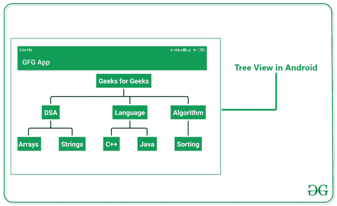

# 安卓中的树形视图，示例

> 原文:[https://www . geesforgeks . org/treeview-in-Android-with-example/](https://www.geeksforgeeks.org/treeview-in-android-with-example/)

如果您正在寻找新的用户界面设计来表示巨大的数据，那么有很多方法来表示这种类型的数据。您可以使用饼图、图表和更多视图类型来实现这些视图。为了显示如此庞大的数据，我们可以选择使用 TreeView。TreeView 类似于树，其中有一个父节点，在该父节点内部，您可以根据需要创建多个节点。在这个例子中，我们可以看看在你的安卓应用程序中创建一个树形视图。现在我们将转向树视图的实现。注意，我们将使用 **Java** 语言来实现这个项目。

## 什么是树形视图，它看起来怎么样？

TreeView 是一种以树的形式表示数据的模式，这样用户就更容易理解我们应用程序中的数据组织。下面给出了一个示例图像，以了解的树形视图看起来像的样子。



## 例子

**第一步:创建新项目**

要在安卓工作室创建新项目，请参考[如何在安卓工作室创建/启动新项目](https://www.geeksforgeeks.org/android-how-to-create-start-a-new-project-in-android-studio/)。注意选择 **Java** 作为编程语言。

**第二步:添加依赖项进行构建. gradle(模块:app)**

导航到**渐变脚本>构建.渐变(模块:应用)**，并在依赖项部分添加以下依赖项。

> 实现“de . blox . treeview:treeview:0 . 1 . 0”

添加这个依赖项后，同步您的项目，现在我们将开始实现它。

**第三步:修改 strings.xml 文件**

下面是 **strings.xml** 文件的代码。

## 可扩展标记语言

```
<resources>
    <string name="app_name">GFG App</string>
    <string name="my_node">Node</string>
</resources>
```