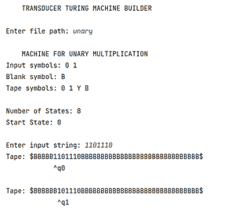
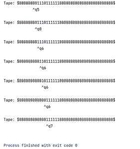

# Java 中的图灵机构造(传感器图灵机)

> 原文:[https://www . geesforgeks . org/turing-machine-construction-transducers-turing-machine-in-Java/](https://www.geeksforgeeks.org/turing-machine-construction-transducers-turing-machine-in-java/)

**先决条件**–[图灵机](https://www.geeksforgeeks.org/turing-machine-in-toc/)

图灵机可以大致分为两种，接受者和转换器。接受者图灵机是用于定义图灵可接受语言的自动机。这样的机器可以用来检查给定的字符串是否属于某种语言。它被定义为 7 元组机器。

来到传感器:一般来说，传感器是用于将一种形式的信号转换成另一种形式的设备。图灵机传感器也是如此。

传感器是一种图灵机，用于在机器执行各种读写操作后，将给定的输入转换为输出。它不接受或拒绝输入，而是执行一系列操作来获得同一磁带中的输出权限，并在完成时停止。

图灵机传感器的几个例子是:

*   [加法图灵机](https://www.geeksforgeeks.org/turing-machine-addition/)
*   [减法图灵机](https://www.geeksforgeeks.org/turing-machine-for-subtraction/)
*   [乘法图灵机](https://www.geeksforgeeks.org/turing-machine-for-multiplication/)
*   [1 和 2 补码图灵机](https://www.geeksforgeeks.org/turing-machine-for-1s-and-2s-complement/)

**实施:**

现在我们将提出一个 [Java](https://www.geeksforgeeks.org/java/) 程序，它被编写来模拟图灵机转换器的构造和执行。执行时必须给出两个输入:定义自动机的. txt 文件(代码后面给出了一元乘法机器的例子)，以及通过控制台窗口输入的字符串，该字符串将作为自动机执行的磁带输入。

那个。txt 文件的路径必须作为输入给出。这样做是为了让相同的程序可以用于不同类型的机器，而不是对自动机进行硬编码。我们只需要编写一个不同的 txt 文件来生成一个不同的自动机。

之所以特别选择 Java，是因为它采用了面向对象的结构，使用这种结构为状态、转换、机器等定义了一个类，以便能够将实体的各个方面封装在一个对象中。例如，转换被定义为一个类，它的成员是三个字符——读、写和移位，分别存储读符号、写符号和移位方向，以及机器应该转换到的下一个状态的索引。这同样适用于状态对象，该对象存储可能的传出转换列表。

**例**

## Java 语言(一种计算机语言，尤用于创建网站)

```java
// Java Program to Illustrate Construction of Turing Machine

// Importing package
package turing_machine;

// Importing required classes
import java.io.File;
import java.io.FileNotFoundException;
import java.util.ArrayList;
import java.util.Scanner;

// Class 1
// Helper class
class Transition {

    char read;
    char write;
    char shift;
    int nextState;

    // Constructor
    // This divides string into specific symbols
    // and next state's number
    Transition(String s)
    {

        read = s.charAt(0);
        write = s.charAt(2);
        shift = s.charAt(4);

        int l = s.length();
        String substr = s.substring(6, l);
        nextState = Integer.parseInt(substr);
    }
}

// Class 2
// Helper class
class State {

    // List of transitions for a state by
    // creating ArrayList object of Transaction type
    ArrayList<Transition> trs;

    State(ArrayList<Transition> ts) { trs = ts; }
}

// Class 3
// Helper class
class Machine {

    // Scanner object to read input
    Scanner fs;
    // Number of states to be read
    int stateCount;
    // Initialized to start state, and then to keep track
    // of current state in automaton
    int currState;
    // To halt the machine when reached, must not contain
    // any transitions
    int finalState;
    // Blank symbol defined for the machine in the input
    // file
    char blankSym;

    // TAPE is a member of machine
    StringBuffer Tape = new StringBuffer();

    // List of states
    ArrayList<State> states = new ArrayList<>();

    // Method 1
    void buildMachine(Scanner f)
    {
        this.fs = f;

        // Printing the title in the first line of input
        // file
        System.out.println("\n\t" + readString());

        // Reading the string of input symbols (space
        // separated)
        String s = readString();
        System.out.println("Input symbols: " + s);

        // Reading string of other tape symbols defined in
        // transitions
        s += " " + readString();

        // Reading the blank symbol from the file
        blankSym = readChar();
        System.out.println("Blank symbol: " + blankSym);

        s += " " + blankSym;
        System.out.println("Tape symbols: " + s);

        // Number of states to be defined, say N
        stateCount = readInt();
        System.out.println("\nNumber of States: "
                           + stateCount);

        // Current state variable (currState) is initialized
        // to start-state
        currState = readInt();
        System.out.println("Start State: " + currState);

        // addState() method is called N number of times
        for (int i = 0; i < stateCount; i++)
            addState(i);
    }

    // Method 2
    void addState(int ind)
    {
        // number of transitions is read for a state and
        // stored in trCount
        int trCount = readInt();

        // state with 0 transitions is assigned to be final
        // state for the machine to halt
        if (trCount == 0)
            finalState = ind;
        ArrayList<Transition> trs = new ArrayList<>();

        for (int i = 0; i < trCount; i++) {

            // Each transition object is created and
            // appended to list
            // of transitions
            String s = readString();
            Transition tr = new Transition(s);
            trs.add(tr);
        }

        // new state object is created by passing list of
        // transitions with the constructor
        State st = new State(trs);
        states.add(st);
    }

    // Method 3
    // To read input from file object "fs" and return it
    String readString()
    {

        String s = fs.next();
        // To ignore lines starting from '//'
        while (s.startsWith("//") || s.isEmpty())
            s = fs.next();
        return s;
    }

    // Method 4
    // To read input from file object as string and
    // return the first character
    char readChar()
    {

        String s = fs.next();
        while (s.startsWith("//") || s.isEmpty())
            s = fs.next();
        return s.charAt(0);
    }

    // Method 5
    // To read input from file object and
    // return it's integer form
    int readInt()
    {
        String s = fs.next();
        while (s.startsWith("//") || s.isEmpty())
            s = fs.next();
        return Integer.parseInt(s);
    }

    // Method 6
    // To perform transitions on the tape starting from
    // currState
    void runTuring(int index) throws InterruptedException
    {

        while (currState != finalState) {

            // Calling makeTrans() to perform transition and
            // returning the index pointed by the R/W head
            index = makeTrans(index);
            if (index == -1)
                throw new InterruptedException(
                    "ERROR: Transition Not Found! Machine HALTED.");

            // Tape instance printed after each transition
            printTape(index);
        }
    }

    int makeTrans(int index) throws InterruptedException
    {
        if (Tape.charAt(index) == '{content}apos;)
            throw new InterruptedException(
                "ERROR: Head left the Tape boundary! Machine HALTED.");

        State st = states.get(currState);

        // to traverse across the list of transitions to
        // match tape symbol with read symbol
        for (Transition tr : st.trs) {
            if (tr.read == Tape.charAt(index)) {
                // to write the write-symbol onto the tape
                Tape.replace(index, index + 1,
                             String.valueOf(tr.write));
                currState = tr.nextState;

                switch (tr.shift) {
                case 'R':
                    return index + 1; // shift right on tape
                case 'L':
                    return index - 1; // shift left on tape
                default:
                    return -1; // unknown shift symbol
                }
            }
        }
        return -1; // transition not found
    }

    void printTape(int index)
    {
        int interval = 500; // in milliseconds
        System.out.println("Tape: " + Tape);
        for (int i = 0; i < index; i++)
            System.out.print(" "); // to align

        // to print the R/W head of machine pointing to
        // particular tape index along with current state
        // index
        System.out.println("      ^q" + currState + "\n");
        try {
            // to print new instance of tape with a
            // particular interval
            Thread.sleep(interval);
        }
        catch (InterruptedException e) {
            System.out.println(e.getMessage());
        }
    }
}

// Class 4
// Helper class
class FileScanner {
    Scanner scan = new Scanner(System.in);
    Scanner fileScan;
    String inputstr;

    FileScanner() throws FileNotFoundException
    {
        // to read the input from .txt file
        System.out.print("Enter file path: ");
        String path = scan.nextLine();
        fileScan = new Scanner(new File(path));
        fileScan.useDelimiter("\n");
    }

    String buildTape(String str, char blank)
    {
        // str is the input string to be added to the tape
        // tape defined to begin and end with '{content}apos; symbol to
        // avoid indefinite transitions

        String s = "{content}quot;; // begin
        for (int i = 0; i < 5; i++)
            s += blank; // adding few blank symbols
        s = s.concat(str); // adding the input string
        for (int i = 0; i < 30; i++)
            s += blank; // adding few more blanks
        s += '{content}apos;; // end
        // this concatenated string forms a Tape and is
        // returned
        return s;
    }

    void setTape(Machine m)
    {
        // read input string from console
        System.out.print("\nEnter input string: ");
        inputstr = scan.nextLine();

        // pass string as parameter to buildTape() method
        m.Tape = new StringBuffer(
            buildTape(inputstr, m.blankSym));

        // 6 == initial index of tape that is pointed by R/W
        // head
        m.printTape(6);
    }
}

// Class 5
// Main class
public class TuringMain {

    // Main driver method
    public static void main(String[] args)
    {

        // Display message for better readability
        System.out.println(
            "\n\tTRANSDUCER TURING MACHINE BUILDER\n");

        // Creating new object of Machine class
        Machine m = new Machine();

        // Try block to check for exceptions
        try {
            FileScanner fileScanner = new FileScanner();

            // constructing the machine using details from
            // Scanner object that reads the file
            m.buildMachine(fileScanner.fileScan);
            fileScanner.setTape(
                m); // setting tape for the machine
            m.runTuring(
                6); // to start execution of Turing Machine
        }
        catch (FileNotFoundException
               | InterruptedException e) {
            System.out.println(e);
            System.exit(0);
        }
    }
}
```

为[一元乘法](https://www.geeksforgeeks.org/turing-machine-for-multiplication/)定义自动机符号、状态和转换的输入文件:

> //程序在读取时会忽略以“//”开头的行，以便对输入文本进行注释
> 
> //标题，将打印在控制台上
> 
> 一元乘法机器
> 
> //输入符号–1 表示定义一元数字，0 表示分隔符
> 
> 0 1
> 
> //除输入以外的磁带符号
> 
> Y
> 
> //空白符号
> 
> B
> 
> //国家数量
> 
> eight
> 
> //开始状态
> 
> Zero
> 
> //过渡
> 
> //格式–读取、写入、移位、下一状态
> 
> //对于状态 q0，需要读取该状态的 2 个转换
> 
> Two
> 
> 1 B R 1
> 
> 0 B R 6
> 
> //状态 q1
> 
> Two
> 
> 0 0 R 2
> 
> 1 1 R 1
> 
> //状态 q2
> 
> Two
> 
> 0 0 1 5
> 
> 1 Y R 3
> 
> //状态 q3
> 
> three
> 
> 0 0 3
> 
> 1 1 R 3
> 
> B 1 L 4
> 
> //状态 q4
> 
> three
> 
> 0 0 1 4
> 
> 1 1 L 4
> 
> Y Y R 2
> 
> //状态 q5
> 
> four
> 
> 0 0 1 5
> 
> 1 1 升 5
> 
> Y 1 L 5
> 
> B B R 0
> 
> //状态 q6
> 
> Two
> 
> 1 个 B6
> 
> 0 B R 7
> 
> //状态 Q7–当定义 0 个转换时，机器达到此状态时停止
> 
> Zero

[图灵机复制数据](https://www.geeksforgeeks.org/turing-machine-for-copying-data/)的文本输入在[链接](https://github.com/tarun-srivatsa/Turing-Machine-Builder-in-Java/blob/main/copy_string)中给出。

**注意:**程序必须在本地机器或接受 I/O 文件路径的 IDE 上执行。

以下是以“1101110”作为输入的一元乘法自动机的输出外观(一元 2 *一元 3):



当机器开始在磁带上执行时，输出的第一部分。

**(多次迭代后)**



每隔一段时间打印完所有磁带后，机器进入最终状态并停止运行。我们可以看到对于 2*3 的输入得到了“111111”或者一元-6。

只要稍加努力，同样的程序也可以扩展到受体型图灵机。鼓励任何感兴趣的人改进这篇文章。