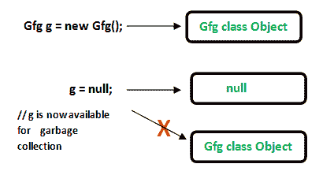
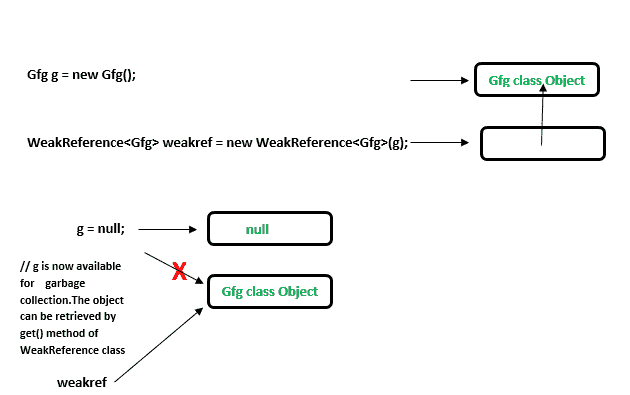
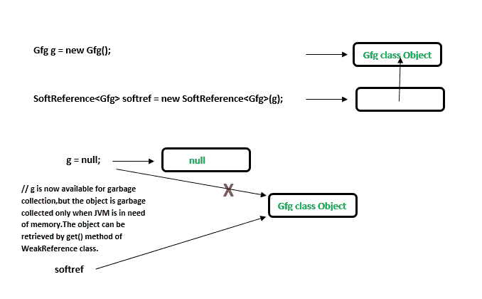

# Java 中引用的类型

> 原文:[https://www.geeksforgeeks.org/types-references-java/](https://www.geeksforgeeks.org/types-references-java/)

在 Java 中，根据垃圾收集的方式，有四种不同类型的引用。

1.  强引用
2.  弱引用
3.  软引用
4.  幻影参考

前提条件:[垃圾收集](https://www.geeksforgeeks.org/garbage-collection-java/)

*   **Strong References:** This is the default type/class of Reference Object. Any object which has an active strong reference are not eligible for garbage collection. The object is garbage collected only when the variable which was strongly referenced points to null.

    ```java
    MyClass obj = new MyClass ();          

    ```

    这里的‘obj’对象是对新创建的 MyClass 实例的强引用，目前 obj 是活动对象，所以不能被垃圾收集。

    ```java
    obj = null;
    //'obj' object is no longer referencing to the instance. 
    So the 'MyClass type object is now available for garbage collection.          

    ```

    

    ```java
    // Java program to illustrate Strong reference
    class Gfg
    {
        //Code..
    }
    public class Example
    {
        public static void main(String[] args)
        {
             //Strong Reference - by default
            Gfg g = new Gfg();    

            //Now, object to which 'g' was pointing earlier is 
            //eligible for garbage collection.
            g = null; 
        }
    } 
    ```

*   **Weak References: **Weak Reference Objects are not the default type/class of Reference Object and they should be explicitly specified while using them.
    *   这种类型的引用在 WeakHashMap 中用于引用条目对象。
    *   如果 JVM 检测到一个只有弱引用的对象(即没有强引用或软引用链接到任何对象对象)，这个对象将被标记为垃圾收集。
    *   为了创建这样的引用[使用 java.lang.ref.WeakReference](https://docs.oracle.com/javase/7/docs/api/java/lang/ref/WeakReference.html) 类。
    *   这些引用在实时应用程序中使用，同时建立一个数据库连接，当使用数据库的应用程序关闭时，该连接可能会被垃圾收集器清除。

    

    ```java
    //Java Code to illustrate Weak reference
    import java.lang.ref.WeakReference;
    class Gfg
    {
        //code
        public void x()
        {
            System.out.println("GeeksforGeeks");
        }
    }

    public class Example
    {
        public static void main(String[] args)
        {
            // Strong Reference
            Gfg g = new Gfg();     
            g.x();

            // Creating Weak Reference to Gfg-type object to which 'g' 
            // is also pointing.
            WeakReference<Gfg> weakref = new WeakReference<Gfg>(g);

            //Now, Gfg-type object to which 'g' was pointing earlier
            //is available for garbage collection.
            //But, it will be garbage collected only when JVM needs memory.
            g = null; 

            // You can retrieve back the object which
            // has been weakly referenced.
            // It successfully calls the method.
            g = weakref.get(); 

            g.x();
        }
    }
    ```

    输出:

    ```java
    GeeksforGeeks
    GeeksforGeeks

    ```

两种不同等级的弱点可以加入:软和幻影

*   **Soft References:** In Soft reference, even if the object is free for garbage collection then also its not garbage collected, until JVM is in need of memory badly.The objects gets cleared from the memory when JVM runs out of memory.To create such references [java.lang.ref.SoftReference](https://docs.oracle.com/javase/7/docs/api/java/lang/ref/SoftReference.html) class is used.
    

    ```java
    //Code to illustrate Soft reference
    import java.lang.ref.SoftReference;
    class Gfg
    {
        //code..
        public void x()
        {
            System.out.println("GeeksforGeeks");
        }
    }

    public class Example
    {
        public static void main(String[] args)
        {
            // Strong Reference
            Gfg g = new Gfg();     
            g.x();

            // Creating Soft Reference to Gfg-type object to which 'g' 
            // is also pointing.
            SoftReference<Gfg> softref = new SoftReference<Gfg>(g);

            // Now, Gfg-type object to which 'g' was pointing
            // earlier is available for garbage collection.
            g = null; 

            // You can retrieve back the object which
            // has been weakly referenced.
            // It successfully calls the method.
            g = softref.get(); 

            g.x();
        }
    }
    ```

    输出:

    ```java
    GeeksforGeeks
    GeeksforGeeks

    ```

*   **Phantom References: **The objects which are being referenced by phantom references are eligible for garbage collection. But, before removing them from the memory, JVM puts them in a queue called ‘reference queue’ . They are put in a reference queue after calling finalize() method on them.To create such references [java.lang.ref.PhantomReference](https://docs.oracle.com/javase/7/docs/api/java/lang/ref/PhantomReference.html) class is used.

    ```java
    //Code to illustrate Phantom reference
    import java.lang.ref.*;
    class Gfg
    {
        //code
        public void x()
        {
            System.out.println("GeeksforGeeks");
        }
    }

    public class Example
    {
        public static void main(String[] args)
        {
            //Strong Reference
            Gfg g = new Gfg();     
            g.x();

            //Creating reference queue
            ReferenceQueue<Gfg> refQueue = new ReferenceQueue<Gfg>();

            //Creating Phantom Reference to Gfg-type object to which 'g' 
            //is also pointing.
            PhantomReference<Gfg> phantomRef = null;

            phantomRef = new PhantomReference<Gfg>(g,refQueue);

            //Now, Gfg-type object to which 'g' was pointing
            //earlier is available for garbage collection.
            //But, this object is kept in 'refQueue' before 
            //removing it from the memory.
            g = null; 

            //It always returns null. 
            g = phantomRef.get(); 

            //It shows NullPointerException.
            g.x();
        }
    }
    ```

    运行时错误:

    ```java
    Exception in thread "main" java.lang.NullPointerException
        at Example.main(Example.java:31)
    ```

    输出:

    ```java
    GeeksforGeeks
    ```

本文由 **[Pratik Agarwal](https://www.facebook.com/Pratik.Agarwal01)** 供稿。如果你喜欢 GeeksforGeeks 并想投稿，你也可以使用[contribute.geeksforgeeks.org](http://www.contribute.geeksforgeeks.org)写一篇文章或者把你的文章邮寄到 contribute@geeksforgeeks.org。看到你的文章出现在极客博客主页上，帮助其他极客。

如果你发现任何不正确的地方，或者你想分享更多关于上面讨论的话题的信息，请写评论。