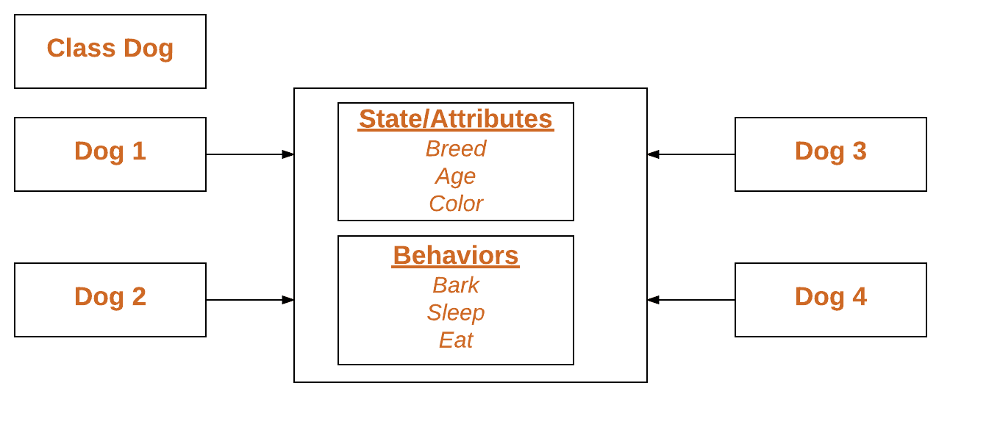
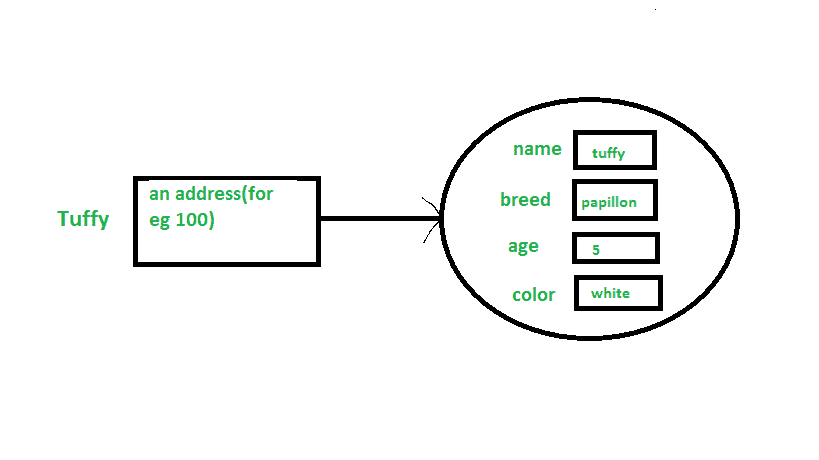
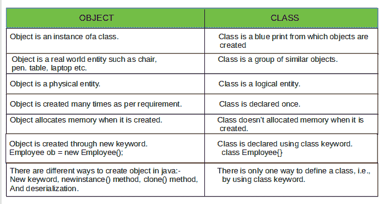

# 理解 Java 中的类和对象

> 原文:[https://www . geesforgeks . org/understanding-class-and-objects-in-Java/](https://www.geeksforgeeks.org/understanding-classes-and-objects-in-java/)

术语*面向对象*解释了将软件组织为不同类型对象的组合的概念，该组合包含了数据和行为。因此，面向对象编程(OOPs)是一种编程模型，它通过提供一些规则来简化软件开发和维护。程序是围绕对象而不是行动和逻辑来组织的。它增加了程序的灵活性和可维护性。理解程序的工作变得更加容易，因为 OOPs 将数据及其行为(方法)放在一个(对象)位置。

**OOPs 的基本概念是:**

1.  [物体](https://www.geeksforgeeks.org/classes-objects-java/)
2.  [级](https://www.geeksforgeeks.org/classes-objects-java/)
3.  [封装](https://www.geeksforgeeks.org/encapsulation-in-java/)
4.  [继承](https://www.geeksforgeeks.org/inheritance-in-java/)
5.  多态性
6.  [抽象](https://www.geeksforgeeks.org/abstraction-in-java-2/)

本文讨论 Java 中的**对象**和**类**。

**面向对象编程中类和对象的需求**

**类:**类是用户定义的蓝图或原型，从中创建对象。它表示一种类型的所有对象共有的一组属性或方法。OOPs 中需要课程，因为:

*   它提供了创建对象的模板，可以将代码绑定到数据中。
*   它有方法和数据的定义。
*   它支持面向对象编程的继承特性，因此可以维护类的层次结构。
*   它有助于维护成员变量的访问规范。

**对象:**它是面向对象编程的基本单元，代表现实生活中的实体。
现实生活中的实体有两个共同的特征:它们都有属性和行为。

**一个物体包括:**

*   **状态:**由物体的*属性*表示。它还显示对象的属性。
*   **行为:**用物体的*方法*来表示。它显示一个对象与其他对象的响应。
*   **标识:**它给一个对象起了一个唯一的名字。它还授予一个对象与其他对象交互的权限。

对象在 OOPs 中是必需的，因为它们可以被创建来调用一个非静态函数，该函数不存在于主方法中，但是存在于类中，并且还提供了用于存储数据的空间的名称。

示例:对于两个数字的相加，需要将两个数字分开存储，以便可以挑选它们并对它们执行所需的操作。因此，创建两个不同的对象来存储这两个数字将是这个场景的理想解决方案。

演示对象和类在 OOPs 中的使用的示例


物体与现实世界中发现的事物有关。例如，图形程序可以具有诸如“圆形”、“正方形”、“菜单”之类的对象。在线购物系统可能有“购物车”、“顾客”和“产品”等对象。

**声明对象(也称为实例化类)**

当一个类的对象被创建时，这个类被称为**实例化**。所有实例共享类的属性和行为。但是这些属性值，即状态对于每个对象都是唯一的。一个类可以有任意数量的实例。

示例:



就像我们声明变量一样(类型名；).这将通知编译器，我们将使用名称来引用类型为 type 的数据。对于一个原始变量，这个声明也为变量保留了适当的内存量。所以对于引用变量，类型必须是严格的具体类名。一般来说，我们**不能**创建抽象类或者接口的对象。

```
Dog tuffy;
```

如果我们像这样声明引用变量(tuffy)，它的值将是未确定的(null)，直到一个对象被实际创建并分配给它。简单地声明一个引用变量不会创建一个对象。

**使用** [**新**](https://www.geeksforgeeks.org/new-operator-java/) 初始化对象

新运算符通过为新对象分配内存并返回对该内存的引用来实例化一个类。新运算符还调用类构造函数。

## Java 语言(一种计算机语言，尤用于创建网站)

```
// Java program to illustrate the concept
// of classes and objects

// Class Declaration

public class Dog {
    // Instance Variables
    String name;
    String breed;
    int age;
    String color;

    // Constructor Declaration of Class
    public Dog(String name, String breed,
               int age, String color)
    {
        this.name = name;
        this.breed = breed;
        this.age = age;
        this.color = color;
    }

    // method 1
    public String getName()
    {
        return name;
    }

    // method 2
    public String getBreed()
    {
        return breed;
    }

    // method 3
    public int getAge()
    {
        return age;
    }

    // method 4
    public String getColor()
    {
        return color;
    }

    @Override
    public String toString()
    {
        return ("Hi my name is " + this.getName() +
          ".\nMy breed, age and color are " + this.getBreed()
           + ", " + this.getAge() + ", " + this.getColor());
    }

    public static void main(String[] args)
    {
        Dog tuffy = new Dog("tuffy", "papillon", 5, "white");
        System.out.println(tuffy.toString());
    }
}
```

**Output:** 

```
Hi my name is tuffy.
My breed, age and color are papillon, 5, white
```

*   这个类包含一个单独的[构造函数](https://www.geeksforgeeks.org/java-gq/constructors-2-gq/)。我们可以识别构造函数，因为它的声明使用与类相同的名称，并且没有返回类型。Java 编译器根据参数的数量和类型来区分构造函数。*狗*类中的构造函数接受四个参数。下面的语句为这些参数提供了“tuffy”、“papillon”、5、“white”作为值:

```
Dog tuffy = new Dog("tuffy", "papillon", 5, "white");
```

执行该语句的结果可以说明如下:



**注意:**所有职业至少有**一个**建造师。如果一个类没有显式声明任何，Java 编译器会自动提供一个无参数构造函数，也称为[默认构造函数](https://www.geeksforgeeks.org/g-fact-50/)。这个默认构造函数调用类父级的无参数构造函数(因为它只包含一个语句，即 super()；)，或者如果类没有其他父类，则为*对象*类构造函数(因为对象类是所有类的直接或间接的父类)。

**创建对象的不同方式**

*   ***使用新的关键字:*** 这是创建对象最简单的方法。通过使用此方法，可以调用所需的构造函数。
    **语法:**

```
ClassName ReferenceVariable = new ClassName();
```

## Java 语言(一种计算机语言，尤用于创建网站)

```
// Java program to illustrate the
// creating and accessing objects
// using new keyword

// base class
class Dog {

    // the class Dog has two fields
    String dogName;
    int dogAge;

    // the class Dog has one constructor
    Dog(String name, int age)
    {
        this.dogName = name;
        this.dogAge = age;
    }
}

// driver class
public class Test {
    public static void main(String[] args)
    {
        // creating objects of the class Dog
        Dog ob1 = new Dog("Bravo", 4);
        Dog ob2 = new Dog("Oliver", 5);

        // accessing the object data through reference
        System.out.println(ob1.dogName + ", " + ob1.dogAge);
        System.out.println(ob2.dogName + ", " + ob2.dogAge);
    }
}
```

**Output:** 

```
Bravo, 4
Oliver, 5
```

*   ***使用 Class.newInstance()方法:*** 用于动态创建新类。它可以调用任何无参数构造函数。该方法返回类**类**对象，在该对象上调用 newInstance()方法，该方法将返回作为命令行参数传递的该类的对象。
    引发不同异常的原因:-
    *class notfoundexception*如果传递的类不存在，就会出现异常。
    *如果传递的类不包含默认构造函数，将会发生实例化异常*，因为 newInstance()方法会在内部调用该特定类的默认构造函数。
    *如果驾驶类别没有访问指定类别定义的权限，将发生 IllegalAccessException* 。
    **语法:**

```
ClassName ReferenceVariable = 
                   (ClassName) Class.forName("PackageName.ClassName").newInstance();
```

## Java 语言(一种计算机语言，尤用于创建网站)

```
// Java program to demonstrate
// object creation using newInstance() method

// Base class
class Example {
    void message()
    {
        System.out.println("Hello Geeks !!");
    }
}

// Driver class
class Test {
    public static void main(String args[])
    {
        try {
            Class c = Class.forName("Example");
            Example s = (Example)c.newInstance();
            s.message();
        }
        catch (Exception e) {
            System.out.println(e);
        }
    }
}
```

**Output:** 

```
Hello Geeks !!
```

*   ***使用 newInstance()方法为 Constructor 类:*** 这是一种反射式的创建对象的方式。通过使用它，可以调用参数化的私有构造函数。它用 InvocationTargetException 包装抛出的异常。它被不同的框架使用——Spring、Hibernate、Struts 等。Constructor.newInstance()方法优于 Class.newInstance()方法。
    **语法:**

```
Constructor constructor = ClassName.class.getConstructor();
 ClassName ReferenceVariable = constructor.newInstance();
```

**示例:**

## Java 语言(一种计算机语言，尤用于创建网站)

```
// java program to demonstrate
// creation of object
// using Constructor.newInstance() method

import java.lang.reflect.Constructor;
import java.lang.reflect.InvocationTargetException;

public class ConstructorExample {

    // different exception is thrown
    public static void main(String[] args)
        throws NoSuchMethodException,
               SecurityException,
               InstantiationException,
               IllegalAccessException,
               IllegalArgumentException,
               InvocationTargetException
    {
        Constructor constructor = ExampleClass.class
                                      .getConstructor(String.class);
        ExampleClass exampleObject = (ExampleClass)constructor
                                         .newInstance("GeeksForGeeks");
        System.out.println(exampleObject.getemp_name());
    }
}

class ExampleClass {

    // private variable declared
    private String emp_name;

    public ExampleClass(String emp_name)
    {
        this.emp_name = emp_name;
    }

    // get method for emp_named to access
    // private variable emp_name
    public String getemp_name()
    {
        return emp_name;
    }

    // set method for emp_name to access
    // private variable emp_name
    public void setemp_name(String emp_name)
    {
        this.emp_name = emp_name;
    }
}
```

**Output:** 

```
GeeksForGeeks
```

*   ***使用克隆()方法:*** 用于克隆一个物体。这是复制对象最简单有效的方法。在代码中， **java.lang.Cloneable** 接口必须由要创建对象克隆的类来实现。如果未实现可克隆接口，clone()方法生成**克隆支持异常**。
    **语法:**

```
ClassName ReferenceVariable = (ClassName) ReferenceVariable.clone();
```

**示例:**

## Java 语言(一种计算机语言，尤用于创建网站)

```
// java program to demonstrate
// object creation using clone() method

// employee class whose objects are cloned
class Employee implements Cloneable {
    int emp_id;
    String emp_name;

    // default constructor
    Employee(String emp_name, int emp_id)
    {
        this.emp_id = emp_id;
        this.emp_name = emp_name;
    }

    public Object clone() throws CloneNotSupportedException
    {
        return super.clone();
    }
}

// driver class
public class Test {

    public static void main(String args[])
    {

        try {
            Employee ob1 = new Employee("Tom", 201);

            // Creating a new reference variable ob2
            // which is pointing to the same address as ob1
            Employee ob2 = (Employee)ob1.clone();

            System.out.println(ob1.emp_id + ", " + ob1.emp_name);
            System.out.println(ob2.emp_id + ", " + ob2.emp_name);
        }
        catch (CloneNotSupportedException c) {
            System.out.println("Exception: " + c);
        }
    }
}
```

**Output:** 

```
201, Tom
201, Tom
```

*   ***使用反序列化:*** 要反序列化对象，首先在类中实现一个**可序列化接口**。此方法中没有用于创建对象的构造函数。
    **语法:**

```
ObjectInputStream in = new ObjectInputStream(new FileInputStream(FileName));
ClassName ReferenceVariable = (ClassName) in.readObject();
```

**示例:**

## Java 语言(一种计算机语言，尤用于创建网站)

```
// Java code to demonstrate object
// creation by deserialization

import java.io.*;

// Base class
class Example implements java.io.Serializable {

    public int emp_id;
    public String emp_name;

    // Default constructor
    public Example(int emp_id, String emp_name)
    {
        this.emp_id = emp_id;
        this.emp_name = emp_name;
    }
}

// Driver class
class Test {
    public static void main(String[] args)
    {
        Example object = new Example(1, "geeksforgeeks");
        String filename = "file1.ser";

        // Serialization
        try {

            // Saving of object in a file
            FileOutputStream file1 = new FileOutputStream(filename);
            ObjectOutputStream out = new ObjectOutputStream(file1);

            // Method for serialization of object
            out.writeObject(object);

            out.close();
            file1.close();

            System.out.println("Object has been serialized");
        }

        catch (IOException ex) {
            System.out.println("IOException is caught");
        }

        Example object1 = null;

        // Deserialization
        try {

            // Reading object from a file
            FileInputStream file1 = new FileInputStream(filename);
            ObjectInputStream in = new ObjectInputStream(file1);

            // Method for deserialization of object
            object1 = (Example)in.readObject();

            in.close();
            file1.close();

            System.out.println("Object has been deserialized");
            System.out.println("Employee ID = " + object1.emp_id);
            System.out.println("Employee Name = " + object1.emp_name);
        }

        catch (IOException ex) {
            System.out.println("IOException is caught");
        }

        catch (ClassNotFoundException ex) {
            System.out.println("ClassNotFoundException is caught");
        }
    }
}
```

**对象和类之间的差异**

