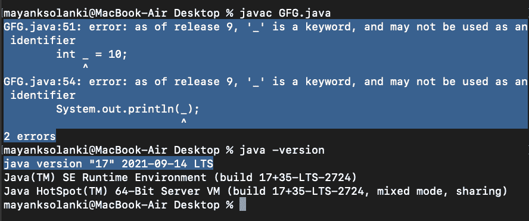

# 在 Java 中使用 _(下划线)作为变量名

> 原文:[https://www . geesforgeks . org/using-_-下划线-变量名-java/](https://www.geeksforgeeks.org/using-_-underscore-variable-name-java/)

正如我们所知[Java 中的变量](https://www.geeksforgeeks.org/variables-in-java/)或者更确切地说是任何语言中的变量被引入来编写代码，在这里建议根据变量在代码中的用法给它们取有意义的名字，特别是在面向对象的语言中，应该尽可能在本地使用变量，而不是只在全局使用它们。这是一个非常重要的属性的变量被检查是进取领域，因为它帮助我们实现更干净和最少的代码。

**案例 1:** 在 Java 8 中使用下划线作为变量名

虽然 Java 8 支持，但如果您使用 _ 作为标识符，则会发出强制警告，告诉您“在 Java SE 8 之后的版本中，可能不支持使用' _ '作为标识符”。

**示例:**

## Java 语言(一种计算机语言，尤用于创建网站)

```java
// Java Program to Illustrate Usage of Underscore
// As a Variable Name

// Main class
class GFG {

    // Main driver method
    public static void main(String args[])
    {
        // Declaring underscore as variable
        // in java 8 only
        int _ = 10;

        // Printing the value stored in it
        System.out.println(_);
    }
}
```

**输出:**

```java
10
```

随着 Java 版本的进步，Java 9 改变了 Java 语言的特性，从法定名称中删除下划线是 Oracle 做出的一个重大改变。在任何情况下都不鼓励使用变量名 **_** 。最新版本的 Java 将这个名称保留为关键字和/或赋予它特殊的语义。如果使用下划线字符(“_”)作为标识符，则无法再编译源代码。我们会得到一个编译时错误。

**案例 2:** 在 Java 9 中使用下划线作为变量名

**示例:**

## Java 语言(一种计算机语言，尤用于创建网站)

```java
// Java program to illustrate Usage of Underscore
// As Variable Name in Java9

// Main class
class GFG {

    // Main driver method
    public static void main(String args[])
    {

        // Declaring underscore as variable
        // in java9 and onwards
        int _ = 10;

        // Printing the value as stored in underscore
        System.out.println(_);
    }
}
```

**输出:**在 Java 9 中，下划线作为变量名是行不通的。下面的源代码不能再编译了。



以下是从上述示例中得出的如下结论，如 **:**

1.  在像 first_name 这样的变量中使用下划线仍然有效。但是使用 _ only 作为变量名不再有效。
2.  即使您使用的是早期版本的 Java，仅使用下划线作为变量名也是一种非常糟糕的编程风格，必须避免。

本文由**阿比舍克·维尔马**供稿。如果你喜欢 GeeksforGeeks 并想投稿，你也可以使用[write.geeksforgeeks.org](http://www.write.geeksforgeeks.org)写一篇文章或者把你的文章邮寄到 review-team@geeksforgeeks.org。看到你的文章出现在极客博客主页上，帮助其他极客。如果你发现任何不正确的地方，或者你想分享更多关于上面讨论的话题的信息，请写评论。