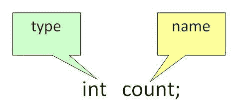

# Java 中的变量

> 原文:[https://www.geeksforgeeks.org/variables-in-java/](https://www.geeksforgeeks.org/variables-in-java/)

**Java 中的变量**是在 Java 程序执行过程中保存数据值的数据容器。每个变量都被分配了一个数据类型，该数据类型指定了它可以保存的值的类型和数量。变量是数据的内存位置名称。

变量是给一个内存位置起的名字。它是程序中的基本存储单元。

*   存储在变量中的值可以在程序执行过程中更改。
*   变量只是给一个内存位置起的名字，所有对变量的操作都会影响这个内存位置。
*   在 Java 中，所有的变量都必须在使用前声明。

### 如何声明变量？

我们可以在 java 中声明变量，如下图所示，作为视觉辅助。



从图中可以很容易地看出，在声明变量时，我们需要注意两件事:

**1。数据类型**:可以存储在这个变量中的数据类型。

**2。数据名称:**变量的名称已给出。

这样，一个名字只能给一个内存位置。可以通过两种方式为其赋值:

*   变量初始化
*   通过输入赋值

### 如何初始化变量？

它可以通过以下三个组件来感知:

*   **数据类型**:可以存储在该变量中的数据类型。
*   **变量名称**:变量的名称。
*   **值**:是变量中存储的初始值。


**插图:**

```
float simpleInterest; 
// Declaring float variable
```

```
int time = 10, speed = 20; 
// Declaring and Initializing integer variable
```

```
char var = 'h'; 
// Declaring and Initializing character variable
```

### Java 中变量的类型

现在让我们讨论不同类型的变量，如下所示:

1.  局部变量
2.  实例变量
3.  静态变量

让我们在这里详细讨论每个变量的特征。

**1。局部变量**

在块、方法或构造函数中定义的变量称为局部变量。

*   这些变量是在进入块时创建的，或者是在退出块后调用并销毁函数时创建的，或者是在调用从函数返回时创建的。
*   这些变量的作用域只存在于声明该变量的块中。也就是说，我们只能在该块中访问这些变量。
*   在定义的范围内使用局部变量之前，必须对其进行初始化。

**2。实例变量**

实例变量是非静态变量，在任何方法、构造函数或块之外的类中声明。

*   由于实例变量是在类中声明的，因此这些变量是在类的对象创建时创建的，而在对象销毁时销毁。
*   与局部变量不同，我们可以使用访问说明符，例如变量。如果我们没有指定任何访问说明符，那么将使用默认的访问说明符。
*   实例变量的初始化不是必需的。它的默认值是 0
*   实例变量只能通过创建对象来访问。

**3。静态变量**

静态变量也称为类变量。

*   这些变量被类似地声明为实例变量。不同之处在于，静态变量是在任何方法构造函数或块之外的类中使用 static 关键字声明的。
*   与实例变量不同，不管我们创建多少对象，每个类只能有一个静态变量的副本。
*   静态变量在程序执行开始时创建，在执行结束时自动销毁。
*   静态变量的初始化不是强制性的。它的默认值是 0
*   如果我们像实例变量一样访问静态变量(通过对象)，编译器将显示警告消息，这不会停止程序。编译器将自动用类名替换对象名。
*   如果我们在没有类名的情况下访问静态变量，编译器会自动追加类名。

### 实例变量与静态变量之间的差异

现在让我们讨论实例变量和静态变量之间的区别

*   每个对象都有其实例变量的副本，而不管我们创建多少个对象，每个类只能有一个静态变量的副本。
*   使用一个对象在实例变量中所做的更改不会反映在其他对象中，因为每个对象都有自己的实例变量副本。在静态的情况下，变化将反映在其他对象中，因为静态变量是一个类的所有对象所共有的。
*   我们可以通过对象引用访问实例变量，使用类名**可以直接访问静态变量。**

**语法:**静态和实例变量

```
class GFG
{
    // Static variable
    static int a; 

    // Instance variable
    int b;        
} 
```

**必读:**

*   [Java 中变量的作用域](https://www.geeksforgeeks.org/variable-scope-in-java/)
*   [c++和 Java 中静态关键字的比较](https://www.geeksforgeeks.org/static-keyword-in-java/)
*   [Java 允许静态局部变量吗？](https://www.geeksforgeeks.org/g-fact-47/)
*   [实例变量隐藏在 Java 中](https://www.geeksforgeeks.org/g-fact-46-instance-variable-hiding-in-java/)

本文由 **Harsh Agarwal** 供稿。如果你喜欢 GeeksforGeeks 并想投稿，你也可以使用[write.geeksforgeeks.org](http://www.write.geeksforgeeks.org)写一篇文章或者把你的文章邮寄到 review-team@geeksforgeeks.org。看到你的文章出现在极客博客主页上，帮助其他极客。如果你发现任何不正确的地方，或者你想分享更多关于上面讨论的话题的信息，请写评论。