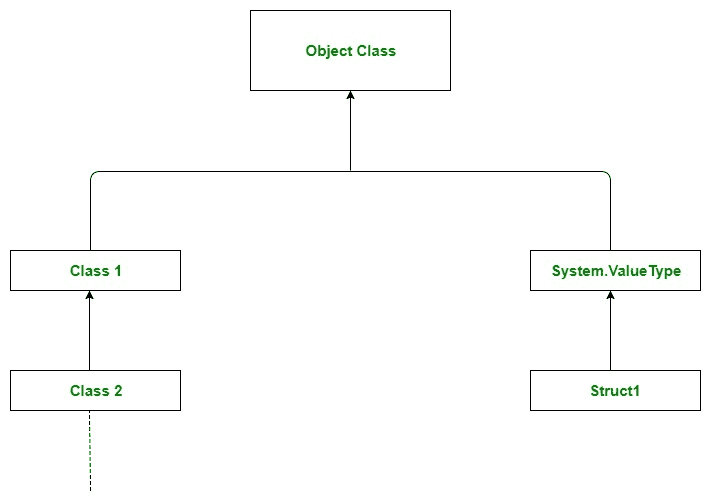

# Java 中的向量克隆()方法，示例

> 原文:[https://www . geesforgeks . org/vector-clone-method-in-Java-with-examples/](https://www.geeksforgeeks.org/vector-clone-method-in-java-with-examples/)

[向量类](https://www.geeksforgeeks.org/java-util-vector-class-java/)的**克隆()**方法用于返回对象类提供的该向量的**浅拷贝** **。它只是创建了一个向量的副本。副本将引用内部数据阵列的克隆，但不引用原始内部数据阵列。**

**语法:**

```java
Vector.clone()
```

**参数:**该方法不取任何参数。

**返回值:**该方法返回一个对象，该对象只是向量的副本。

**抛出异常:** *克隆支持异常:* 如果对象的类不支持可克隆接口，则会抛出此异常。

**例 1:**

## Java 语言(一种计算机语言，尤用于创建网站)

```java
// Java Program to Illustrate clone() method of Vector class

// Importing required classes
import java.util.*;

// Main class
// VectorDemo
public class GFG {

    // Main driver method
    public static void main(String args[])
    {

        // Creating an empty Vector by creating object
        // of vector class of string type
        Vector<String> vec_tor = new Vector<String>();

        // Adding custom input elements into the vector
        // using add() method
        vec_tor.add("Welcome");
        vec_tor.add("To");
        vec_tor.add("Geeks");
        vec_tor.add("For");
        vec_tor.add("Geeks");

        // Print and display all vector elements
        System.out.println("Vector: " + vec_tor);

        // Creating another vector to copy by
        // creating an object of Object class
        Object copy_vector = vec_tor.clone();

        // Print and display the cloned vector elements
        System.out.println("The cloned vector is: "
                           + copy_vector);
    }
}
```

**Output**

```java
Vector: [Welcome, To, Geeks, For, Geeks]
The cloned vector is: [Welcome, To, Geeks, For, Geeks]
```

**例 2:**

## Java 语言(一种计算机语言，尤用于创建网站)

```java
// Java Program to Illustrate clone() method of Vector class

// Importing required classes
import java.util.*;

// Main class
// VectorDemo
public class VectorDemo {

    // Main driver method
    public static void main(String args[])
    {
        // Creating an empty Vector by creating
       // object of Vector class of Integer type
        Vector<Integer> vec_tor = new Vector<Integer>();

        // Add custom input elements for 
        // using add() method
        vec_tor.add(10);
        vec_tor.add(15);
        vec_tor.add(30);
        vec_tor.add(20);
        vec_tor.add(5);

        // Print and display the vector elements
        System.out.println("Vector: " + vec_tor);

        // Creating another vector to copy by
        // creating object of Object class
        Object copy_vector = (Vector)vec_tor.clone();

        // Print and display elements of cloned vector
        System.out.println("The cloned vector is: " + copy_vector);
    }
}
```

**Output**

```java
Vector: [10, 15, 30, 20, 5]
The cloned vector is: [10, 15, 30, 20, 5]
```



> **注意:**在上面的例子中，我们通过创建 Object 类本身的对象来克隆向量，因为它确实提供了 clone()方法。因此，如果对象类不支持任何可克隆的接口，那么它将不允许克隆和复制向量元素，因此它将抛出 cloneotsupportedexception**。**