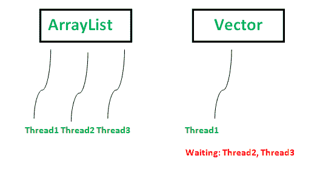

# Java 中的向量 vs 数组列表

> 原文:[https://www.geeksforgeeks.org/vector-vs-arraylist-java/](https://www.geeksforgeeks.org/vector-vs-arraylist-java/)

[数组列表](https://www.geeksforgeeks.org/arraylist-in-java/)和[向量](https://www.geeksforgeeks.org/java-util-vector-class-java/)都实现了列表接口，并且都使用**(可动态调整大小的)数组**作为其内部数据结构，很像使用普通数组。
**语法:**

```

   ArrayList<T> al = new ArrayList<T>();
   Vector<T> v = new Vector<T>(); 
```

数组列表和向量的主要区别:

1.  **同步:** Vector 是**同步的**，这意味着一次只有一个线程可以访问代码，而 arrayList 是**不同步的**，这意味着多个线程可以同时在 arrayList 上工作。例如，如果一个线程正在执行添加操作，那么在多线程环境中可能有另一个线程正在执行移除操作。
    如果多个线程同时访问数组列表，那么我们必须同步在结构上修改列表的代码块，或者允许简单的元素修改。结构修改是指从列表中添加或删除元素。设置现有元素的值不是结构修改。
    [](https://media.geeksforgeeks.org/wp-content/uploads/ArrayList-vs-Vector-Java.png)
2.  **性能:** **数组列表更快**，因为它是非同步的，而向量操作的性能更慢，因为它们是同步的(线程安全的)。如果一个线程在一个向量上工作，它已经获得了一个锁，这就迫使任何其他想在其上工作的线程必须等待，直到锁被释放。
3.  **数据增长:** ArrayList 和 Vector **都可以动态地增长和收缩**以保持存储的最佳使用，但是它们调整大小的方式不同。如果元素数量超过其容量，ArrayList 将增加当前数组大小的 50%，而 vector 将增加 100%–实际上是当前数组大小的两倍。
4.  **遍历:**向量可以同时使用 **[枚举和](https://www.geeksforgeeks.org/iterators-in-java/)** 遍历向量的元素，而数组列表只能使用**迭代器**遍历。
5.  **应用程序:**大多数时候，程序员更喜欢数组列表而不是向量，因为[数组列表可以使用 collections . synchronized list](https://www.geeksforgeeks.org/synchronization-arraylist-java/)显式同步。

*注意:在没有具体要求使用 vector 的情况下，以 ArrayList 为佳。*

```
// Java Program to illustrate use of ArrayList
// and Vector in Java
import java.io.*;
import java.util.*;

class GFG
{
    public static void main (String[] args)
    {
        // creating an ArrayList
        ArrayList<String> al = new ArrayList<String>();

        // adding object to arraylist
        al.add("Practice.GeeksforGeeks.org");
        al.add("quiz.GeeksforGeeks.org");
        al.add("code.GeeksforGeeks.org");
        al.add("contribute.GeeksforGeeks.org");

        // traversing elements using Iterator'
        System.out.println("ArrayList elements are:");
        Iterator it = al.iterator();
        while (it.hasNext())
            System.out.println(it.next());

        // creating Vector
        Vector<String> v = new Vector<String>();
        v.addElement("Practice");
        v.addElement("quiz");
        v.addElement("code");

        // traversing elements using Enumeration
        System.out.println("\nVector elements are:");
        Enumeration e = v.elements();
        while (e.hasMoreElements())
            System.out.println(e.nextElement());
    }
}
```

输出:

```
ArrayList elements are:
Practice.GeeksforGeeks.org
quiz.GeeksforGeeks.org
code.GeeksforGeeks.org
contribute.GeeksforGeeks.org

Vector elements are:
Practice
quiz
code

```

**数组列表和向量如何选择？**

*   数组列表是不同步的，不是线程安全的，而向量是线程安全的。一次只能有一个线程调用 Vector 上的方法，这是一个轻微的开销，但是在安全问题上很有帮助。因此，在单线程的情况下，数组列表是显而易见的选择，但是就多线程而言，向量通常更可取。
*   如果我们不知道我们将会有多少数据，但是知道它增长的速度，向量有优势，因为我们可以设置向量的增量值。
*   数组列表更新更快。如果我们对使用其中任何一个都没有任何明确的要求，我们使用数组列表而不是向量。

本文由 **Nitsdheerendra** 供稿。如果你喜欢 GeeksforGeeks 并想投稿，你也可以使用[write.geeksforgeeks.org](https://write.geeksforgeeks.org)写一篇文章或者把你的文章邮寄到 review-team@geeksforgeeks.org。看到你的文章出现在极客博客主页上，帮助其他极客。

如果你发现任何不正确的地方，或者你想分享更多关于上面讨论的话题的信息，请写评论。