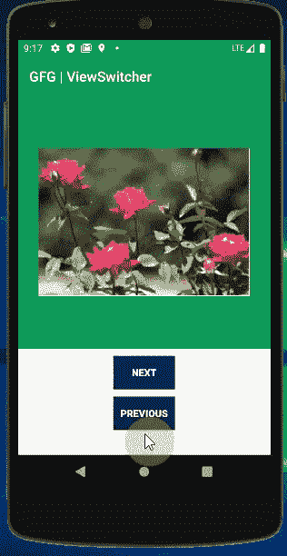

# 安卓中的视图切换器示例

> 原文:[https://www . geesforgeks . org/view switcher-in-Android-with-example/](https://www.geeksforgeeks.org/viewswitcher-in-android-with-example/)

所有安卓应用程序都将有一个切换不同视图的功能，以便解释/推广他们的网站或产品。通过展示不同的视图来直观地展示产品，会很容易给顾客留下深刻印象。在本文中，让我们看看如何将“视图切换器”引入安卓。视图切换器是视图动画器的一个子类，用于在视图之间切换，为客户带来不同的视图。它是过渡小部件的一个元素，帮助我们在视图上添加过渡。我们可以用它在屏幕上制作视图动画。视图切换器还可以在两个不同的视图(即[文本视图](https://www.geeksforgeeks.org/textview-widget-in-android-using-java-with-examples/)、[图像视图](https://www.geeksforgeeks.org/imageview-in-kotlin/)或任何布局)之间平滑切换，由于该功能，用户可以通过在任何需要的地方交替显示文本视图、图像视图来打动客户。在我们的例子中，让我们看看 ImageView 本身。

> **重要提示:**视图切换器只能有两个子视图，一次只能显示一个。如果您在 ViewSwitcher 中有两个以上的子视图，将会出现 Java . lang . illegalsteexception of“不能向 ViewSwitcher 添加两个以上的视图”错误。

### 视图切换器初始化

## Java 语言(一种计算机语言，尤用于创建网站)

```
// We can initialize ViewSwitcher in the below way , where
// simpleViewSwitcher1
// is the id of ViewSwitcher in xml file. Usually xml file
// name will be
// activity_main but we can have meaningful name.
// let our xml file name be activity_viewswitcher
ViewSwitcher simpleViewSwitcher1 = (ViewSwitcher)findViewById(R.id.simpleViewSwitcher1);
```

让我们看看视图切换器的重要方法，它们的功能和代码实现

### 重要方法

**一般方法及其说明:**

<figure class="table">

| 

一般方法

 | 

描述

 |
| --- | --- |
| getNextView() | 为了返回到要在视图切换器中显示的下一个视图，使用 getNextView()方法，它返回要显示的下一个视图。 |
| 重置() | 可能需要在点击事件时重置视图切换器因此它的行为就像第一次动画还没有播放一样。

为此使用了 reset()方法。 |
| showNext() | 视图切换器只能有 2 个视图。一次只显示一个视图。要显示下一个视图，所需的方法是 showNext() |
| 显示上一个() | 视图切换器只能有 2 个视图。一次只显示一个视图。要显示上一个视图，所需的方法是 showPrevious() |

</figure>

**动画相关方法:**

<figure class="table">

| 

动画相关方法

 | 

描述

 |
| --- | --- |
| 加载动画(上下文上下文，整数) | 每当我们需要定义的对象时，都会使用此方法通过调用

静态方法 loadAnimation。 |
| setina 动画(loadIn) | 为了在屏幕上设置物体外观的动画 |
| 扇形动画(out) | 当我们显示下一个视图时，第一个视图必须被移除这是通过使用 setOutAnimation()完成的 |
| 设置工厂(视图工厂工厂) | 它用于为视图切换器创建新视图。旧的是替换，并使用此方法创建新视图。 |

</figure>

**视图切换器的属性**

通过查看属性以及有助于项目的方法。

<figure class="table">

| 

属性

 | 

描述

 |
| --- | --- |
| 身份证明（identification） | 唯一标识视图切换器。 |
| 填料

*   向右划水
*   划水
*   填充顶部
*   划水底部
*   填料

 | 该属性用于设置视图切换器左侧、右侧、顶部或底部的填充

*   从视图切换器的右侧设置填充。
*   从视图切换器的左侧设置填充。
*   从视图切换器的顶部设置填充
*   从视图切换器的底部设置填充。
*   从视图切换器的所有侧面设置填充。

 |
| 背景 | 通过此方法设置视图切换器的背景。要发出令人愉悦的吸引力，必须设置背景。 |

</figure>

我们可以在背景中设置颜色或可绘制的背景:

## 可扩展标记语言

```
<ViewSwitcher
android:id="@+id/simpleViewSwitcher1"
android:layout_width="match_parent"
android:layout_height="wrap_content"
android:padding="20dp" 
android:background="#0F9D58">
<!-- set 20 dp padding from all the sides of ViewSwitcher
     set GFG specified color in the background of ViewSwitcher -->

<!-- Rest of view are here -- >

</ViewSwitcher>
```

我们可以通过**视图切换器** Java 类设置背景:

## Java 语言(一种计算机语言，尤用于创建网站)

```
// set any color that you want
simpleViewSwitcher1.setBackgroundColor(Color.<Your favorite color>);
```

**例**

下面给出了一个 GIF 示例，来了解一下在这篇文章中要做什么。注意，我们将使用 **Java** 语言来实现这个项目。



### 逐步实施

**第一步:创建新项目**

要在安卓工作室创建新项目，请参考[如何在安卓工作室创建/启动新项目](https://www.geeksforgeeks.org/android-how-to-create-start-a-new-project-in-android-studio/)。注意选择 **Java** 作为编程语言。

**步骤 2:使用 activity_main.xml 文件**

转到 **activity_main.xml** 文件，参考以下代码。下面是 **activity_main.xml** 文件的代码。

## 可扩展标记语言

```
<LinearLayout
    xmlns:android="http://schemas.android.com/apk/res/android"
    android:layout_width="match_parent"
    android:layout_height="match_parent"
    android:orientation="vertical">

    <!-- ViewSwitcher with two views one is ImageView and other
         is LinearLayout in which we have a ImageView and a TextView -->
    <ViewSwitcher
        android:id="@+id/simpleViewSwitcher"
        android:layout_width="match_parent"
        android:layout_height="wrap_content"
        android:background="#0F9D58"
        android:padding="20dp">

        <ImageView
            android:layout_width="wrap_content"
            android:layout_height="wrap_content"
            android:layout_gravity="center"
            android:src="@drawable/bir" />

        <LinearLayout
            android:layout_width="match_parent"
            android:layout_height="wrap_content"
            android:gravity="center"
            android:orientation="vertical">

            <ImageView
                android:layout_width="wrap_content"
                android:layout_height="wrap_content"
                android:layout_gravity="center"
                android:src="@drawable/bird" />

        </LinearLayout>

        <LinearLayout
            android:layout_width="match_parent"
            android:layout_height="wrap_content"
            android:gravity="center"
            android:orientation="vertical">

            <ImageView
                android:layout_width="wrap_content"
                android:layout_height="wrap_content"
                android:layout_gravity="center"
                android:src="@drawable/bird" />

        </LinearLayout>

    </ViewSwitcher>

    <Button
        android:id="@+id/buttonNext"
        android:layout_width="wrap_content"
        android:layout_height="wrap_content"
        android:layout_gravity="center"
        android:layout_marginTop="10dp"
        android:background="#005"
        android:text="NEXT"
        android:textColor="#fff"
        android:textStyle="bold" />

    <Button
        android:id="@+id/buttonPrevious"
        android:layout_width="wrap_content"
        android:layout_height="wrap_content"
        android:layout_gravity="center"
        android:layout_marginTop="10dp"
        android:background="#005"
        android:text="PREVIOUS"
        android:textColor="#fff"
        android:textStyle="bold" />

</LinearLayout>
```

**步骤 3:使用 MainActivity.java 文件**

转到**MainActivity.java**文件，参考以下代码。以下是**MainActivity.java**文件的代码。代码中添加了注释，以更详细地理解代码。

## Java 语言(一种计算机语言，尤用于创建网站)

```
import android.os.Bundle;
import android.view.View;
import android.view.animation.Animation;
import android.view.animation.AnimationUtils;
import android.widget.Button;
import android.widget.ViewSwitcher;
import androidx.appcompat.app.AppCompatActivity;

public class MainActivity extends AppCompatActivity {

    private ViewSwitcher simpleViewSwitcher;
    Button btnNext, btnPrev;

    @Override
    protected void onCreate(Bundle savedInstanceState) {
        super.onCreate(savedInstanceState);
        setContentView(R.layout.activity_main);

        // get The references of Button and ViewSwitcher
        btnNext = (Button) findViewById(R.id.buttonNext);
        btnPrev = (Button) findViewById(R.id.buttonPrevious);

        // get the reference of ViewSwitcher
        simpleViewSwitcher = (ViewSwitcher) findViewById(R.id.simpleViewSwitcher);

        // Declare in and out animations and load them using AnimationUtils class
        Animation in = AnimationUtils.loadAnimation(this, android.R.anim.slide_in_left);
        Animation out = AnimationUtils.loadAnimation(this, android.R.anim.slide_out_right);

        // set the animation type to ViewSwitcher
        simpleViewSwitcher.setInAnimation(in);
        simpleViewSwitcher.setOutAnimation(out);

        // ClickListener for NEXT button
        // When clicked on Button ViewSwitcher will switch between views
        // The current view will go out and next view will come in with specified animation
        btnNext.setOnClickListener(new View.OnClickListener() {

            public void onClick(View v) {
                // show the next view of ViewSwitcher
                simpleViewSwitcher.showNext();
            }
        });

        btnPrev.setOnClickListener(new View.OnClickListener() {

            public void onClick(View v) {
                // show the previous view of ViewSwitcher
                simpleViewSwitcher.showPrevious();
            }
        });
    }
}
```

**输出**

在 android studio 中运行 android 代码时，我们可以获得如所附视频所示的输出。这是一个有用的功能，在许多安卓应用中使用。

<video class="wp-video-shortcode" id="video-503848-1" width="640" height="360" preload="metadata" controls=""><source type="video/mp4" src="https://media.geeksforgeeks.org/wp-content/uploads/20201022143904/ViewSwitcherExample1.mp4?_=1">[https://media.geeksforgeeks.org/wp-content/uploads/20201022143904/ViewSwitcherExample1.mp4](https://media.geeksforgeeks.org/wp-content/uploads/20201022143904/ViewSwitcherExample1.mp4)</video>