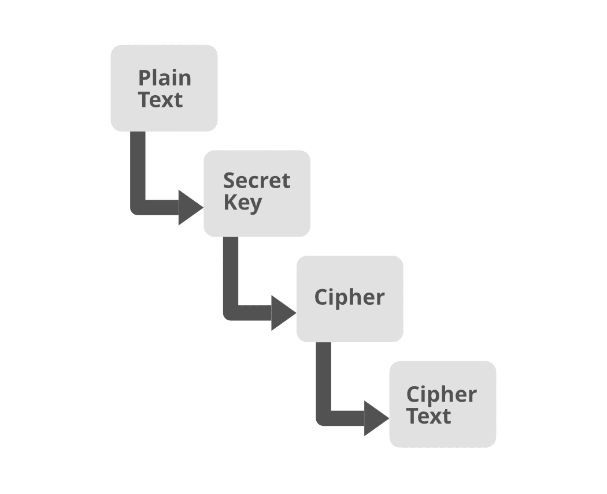

# 什么是 Java AES 加解密？

> 原文:[https://www . geesforgeks . org/what-is-Java-AES-加密和解密/](https://www.geeksforgeeks.org/what-is-java-aes-encryption-and-decryption/)

Java 作为一种编程语言，在技术领域引入了一种新的方法。Java 占据了编码技术的榜首。一家 Java 应用程序设计公司可以做任何事情，从综合商业软件到手机和无线设备的应用程序。这种无处不在的软件支持总是通过功能方法嵌入，并已被纳入常见的互联网浏览器。这意味着类似的密钥被用于加密和解码。(AES)是一种常用的密钥加密计算。

保护数据传输的安全有多种方式。但是大多数专家认为数据加密是最好的方法，目前，Java AES 是一种先进的加密解决方案。新算法正在取代旧的 DES 值，走向 AES。它具有更好的传统机密属性、数据身份验证和高级别的完整性。

让我们用一个密钥来破解解密和加密。与其他保护敏感信息的方法相比，这是一个巨大的优势。对于需要保护敏感信息的政府机构和金融机构来说，这是最好的解决方案。

**对称加密标准的普及**

随着网络安全问题的出现，使用 AES 作为一种先进的方法成为最佳选择，因为它有 3 个分组密码。他们可以用密钥对 128 位数据块进行加密。发送者和接收者都拥有相同的密钥，以便将信息保密。这使得它成为一个灵活和安全的工具。它在固定的块模式或使用数据位的流模式下工作。目前，这些应用程序普遍用于电子邮件通信、顶级域名系统以及即时消息。

**为 AES 选择正确的填充方案**

在分组密码模式下，纯文本被转换为用于加密的块大小。这里需要填充，Java 提供了 3 种选择。对于编码，AES 算法本质上是重复的，支持 128、192 和 256 位。

它的功能如下图所示。



1.  电子码本
2.  密码阻塞链
3.  密码反馈
4.  输出反馈
5.  计数器
6.  伽罗瓦/计数器模式

需要选择密钥来验证应用程序的未来性。

## Java 语言(一种计算机语言，尤用于创建网站)

```
// Java program to demonstrate the creation
// of Encryption and Decryption with Java AES
import java.nio.charset.StandardCharsets;
import java.security.spec.KeySpec;
import java.util.Base64;
import javax.crypto.Cipher;
import javax.crypto.SecretKey;
import javax.crypto.SecretKeyFactory;
import javax.crypto.spec.IvParameterSpec;
import javax.crypto.spec.PBEKeySpec;
import javax.crypto.spec.SecretKeySpec;

class AES {
    // Class private variables
    private static final String SECRET_KEY
        = "my_super_secret_key_ho_ho_ho";

    private static final String SALT = "ssshhhhhhhhhhh!!!!";

    // This method use to encrypt to string
    public static String encrypt(String strToEncrypt)
    {
        try {

            // Create default byte array
            byte[] iv = { 0, 0, 0, 0, 0, 0, 0, 0,
                          0, 0, 0, 0, 0, 0, 0, 0 };
            IvParameterSpec ivspec
                = new IvParameterSpec(iv);

            // Create SecretKeyFactory object
            SecretKeyFactory factory
                = SecretKeyFactory.getInstance(
                    "PBKDF2WithHmacSHA256");

            // Create KeySpec object and assign with
            // constructor
            KeySpec spec = new PBEKeySpec(
                SECRET_KEY.toCharArray(), SALT.getBytes(),
                65536, 256);
            SecretKey tmp = factory.generateSecret(spec);
            SecretKeySpec secretKey = new SecretKeySpec(
                tmp.getEncoded(), "AES");

            Cipher cipher = Cipher.getInstance(
                "AES/CBC/PKCS5Padding");
            cipher.init(Cipher.ENCRYPT_MODE, secretKey,
                        ivspec);
            // Return encrypted string
            return Base64.getEncoder().encodeToString(
                cipher.doFinal(strToEncrypt.getBytes(
                    StandardCharsets.UTF_8)));
        }
        catch (Exception e) {
            System.out.println("Error while encrypting: "
                               + e.toString());
        }
        return null;
    }

    // This method use to decrypt to string
    public static String decrypt(String strToDecrypt)
    {
        try {

            // Default byte array
            byte[] iv = { 0, 0, 0, 0, 0, 0, 0, 0,
                          0, 0, 0, 0, 0, 0, 0, 0 };
            // Create IvParameterSpec object and assign with
            // constructor
            IvParameterSpec ivspec
                = new IvParameterSpec(iv);

            // Create SecretKeyFactory Object
            SecretKeyFactory factory
                = SecretKeyFactory.getInstance(
                    "PBKDF2WithHmacSHA256");

            // Create KeySpec object and assign with
            // constructor
            KeySpec spec = new PBEKeySpec(
                SECRET_KEY.toCharArray(), SALT.getBytes(),
                65536, 256);
            SecretKey tmp = factory.generateSecret(spec);
            SecretKeySpec secretKey = new SecretKeySpec(
                tmp.getEncoded(), "AES");

            Cipher cipher = Cipher.getInstance(
                "AES/CBC/PKCS5PADDING");
            cipher.init(Cipher.DECRYPT_MODE, secretKey,
                        ivspec);
            // Return decrypted string
            return new String(cipher.doFinal(
                Base64.getDecoder().decode(strToDecrypt)));
        }
        catch (Exception e) {
            System.out.println("Error while decrypting: "
                               + e.toString());
        }
        return null;
    }
}

// driver code
public class Main {
    public static void main(String[] args)
    {
        // Create String variables
        String originalString = "GeeksforGeeks";

        // Call encryption method
        String encryptedString
            = AES.encrypt(originalString);

        // Call decryption method
        String decryptedString
            = AES.decrypt(encryptedString);

        // Print all strings
        System.out.println(originalString);
        System.out.println(encryptedString);
        System.out.println(decryptedString);
    }
}
```

**Output**

```
GeeksforGeeks
LuBu3DTLx7SLfjfhbjl7lw==
GeeksforGeeks
```

如果没有适当的填充块，则系统显示密码错误。在允许 Java AES 工作之前，进行安全测试也很重要。AES 使用输入数据、密钥和 IV.IV .密钥通过随机数生成或由密码驱动。就安全最佳实践而言，该系统的效果最好。了解 AES 256 加密对敏感数据使用数学代码非常重要。

**AES 的优势**

*   它允许数据保持安全，直到它被秘密密钥泄露。
*   许多企业现在可以用它来防止黑客窃取信息。
*   对于那些要求数据以牢不可破的格式传输并安全传输的机构来说，这是最灵活、最可行的选择。

美国国家安全局批准了最早的 AES。事实证明，它的速度与发送方和接收方的相同密钥以及它的长度一起是最有用的。分组密码仍然是置换组合的明星。它还具有额外的安全性，圆键需要多次修改。加密的每个阶段/级别都发挥着重要的作用。钥匙越长，轮数越多，可确保高性能。