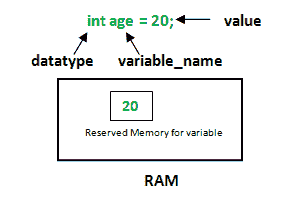

# Java 中的字段、变量、属性、属性有什么区别

> 原文:[https://www . geesforgeks . org/Java 中字段变量属性和属性的区别是什么/](https://www.geeksforgeeks.org/what-is-the-difference-between-field-variable-attribute-and-property-in-java/)

**变量**变量是给一个内存位置起的名字。它是程序中的基本存储单元。
存储在变量中的值可以在程序执行过程中改变。每个变量都有一个类型，如 int、double 或 Object，以及一个作用域。类变量可以是实例变量、局部变量或常量。还有，你应该知道，有些人喜欢调用最终的非静态变量。在 Java 中，所有的变量都必须在使用前声明。



**字段**一个类的数据成员。除非另有说明，否则字段可以是公共的、静态的，而不是静态的和最终的。

```
public class Customer {

    // Fields of customer
    final String field1 = "Fixed Value";
    int name;
}
```

**属性**属性是字段的另一个术语。它通常是一个可以直接访问的公共字段。让我们看看 Array 的一个特殊情况，数组实际上是一个对象，您正在访问表示数组长度的公共常量值。

在 NetBeans 或 Eclipse 中，当我们键入一个类的对象时，在那个点(。)他们给出了一些建议，这些建议被称为属性。
**注:此处永不显示私域**


**属性**它也用于字段，它通常有 getter 和 setter 组合。
例:

```
public class Test {
    private int number;

    public int getNumber()
    {
        return this.number;
    }

    public void setNumber(int num)
    {
        this.number = num;
    }
}
```

### 例子

```
public class Variables {

    // Constant
    public final static String name = "robot";

    // Value
    final String dontChange = "India";

    // Field
    protected String rever = "GANGA";

    // Property
    private String age;

    // Still the property
    public String getAge()
    {
        return this.age;
    }

    // And now the setter
    public void setAge(String age)
    {
        this.age = age;
    }
}
```